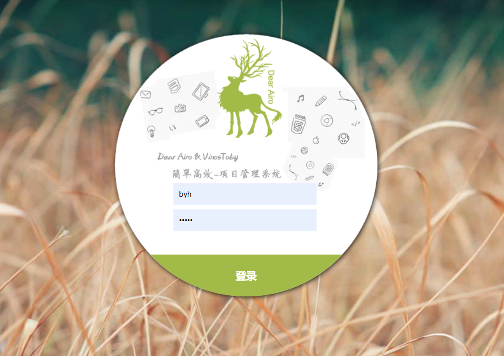

# -
校园网上订餐系统

基于ssm的校园网上订餐系统(源代码+数据库)
一、系统介绍

本项目分为管理员与普通用户两种角色

    前台模块 前台主要功能有：用户注册、用户登录、我的购物车、我的订单、商品评论、校园资讯、修改密码
    后台模块 后台主要功能有：用户管理、商品管理、订单管理、评论管理、资讯管理等

二、所用技术

    后端使用Java+ssm+MyBatis+MySQL+shiro
    前端使用jsp

三、环境介绍

基础环境 :IDEA/eclipse, JDK 1.8, Mysql5.7,Maven，tomcat8.0

所有项目以及源代码本人均调试运行无问题 可支持远程调试运行
四、页面截图

